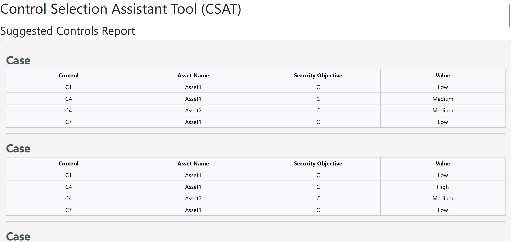
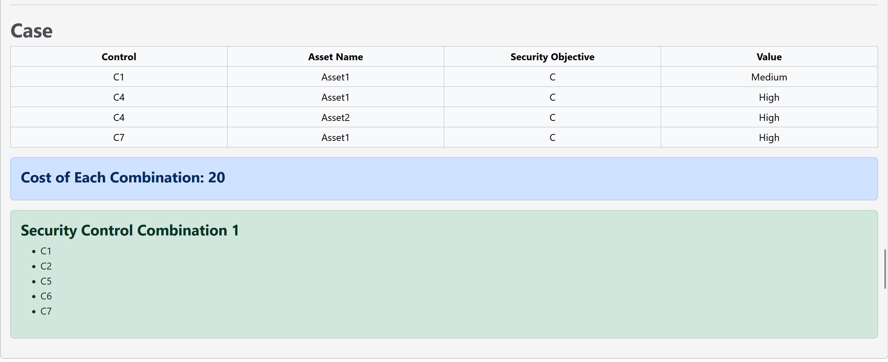

#Control Selection Assistant Tool (CSAT)
CSAT is a tool used to assist security analysts with control selection. The tool uses game theory and expected attacker profiles to help find the suggested controls for the system.

##Running the Tool
To tool can be run from terminal using python. This is shown below. 

```
python app.py
```

CSAT is a web application. By default, CSAT is hosted on http://127.0.0.1:5000/

##Using the Tool
Using the tool involves performing two simple steps.

###Step 1 --- Processing the Control Specification File
When launching the tool, you will be met with a prompt for the control specification file. 


You can download the template for this file from this screen. Additionally, an example template with filled controls can also be downloaded.


Clicking ```Browse``` allows you to browse to your own specification file. Clicking ```Submit Control File``` will submit the file for processing.

###Step 2 --- Finding Suggested Security Controls
You will be greeted with the following screen. 


The first input corresponds to the budget of the system. This value can be simply typed inside this prompt.

The second input corresponds to the attacker profile. Each asset is represented as a button and can be expanded to show the security objectives that may be targeted by an attacker profile (i.e., confidentiality, integrity, availability).

Another ordered objective can be added by clicking the ```Add Ordered Objective``` button. 

An example of this screen populated with a budget of 20 is shown below. In this picture, an attacker profile is provided in which the first ordered objective is to protect the confidentiality of Asset 1 and Asset 2, and the intergrity of Asset 1, and the second ordered objective is to protect the availability of Asset 1 and integrity of Asset 2.


When the ```Submit``` button is pressed, a report like the one below is generated. This report shows the suggested controls for the system. In the report below, multiple effectiveness values were provided for the controls, resulting in many cases. As a result, control suggestions for each case is shown.


  